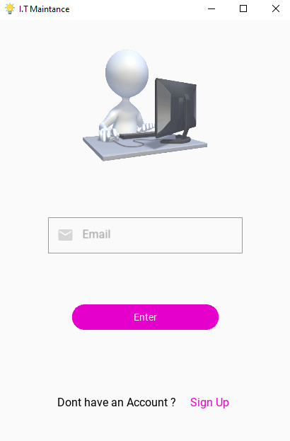
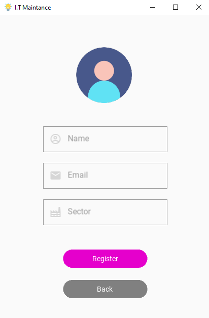
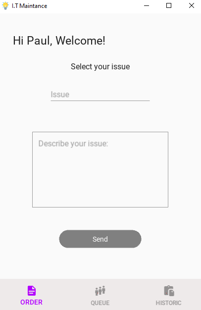
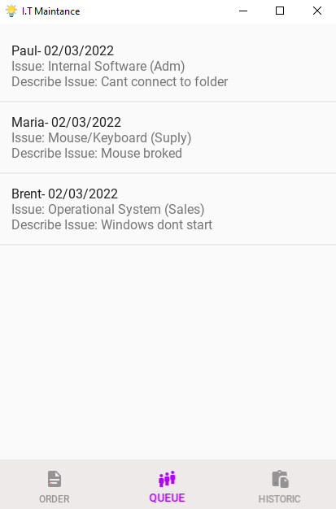

I.T Maintance
-------------

Application to control the maintenance of computers in sectors of a company.

----------------
The Project
-

The idea of this project is that the employees of a company can make maintenance requests when necessary.
In addition, they can follow the progress of calls within a screen called "Queue".

Each user registers with their name, email and company sector.
From there, it can execute a call and be recognized in the request queue.

The maintenance team can access this list and schedule the execution of each request.

Dependencies
=
See "requirements.txt"

Screens
=
_Login_
-

_SignUp_
=

_Request Window_
=

On this screen, the user points to which category of problem he requires assistance and details of what happened.

Queue
=

Here, both the users and the maintenance team can follow and execute the tasks

Future Ideas
=
Implement an interface for the maintenance team to delete requests already made. In addition,
Assemble a maintenance history to follow the demands, and expenses with the services.

